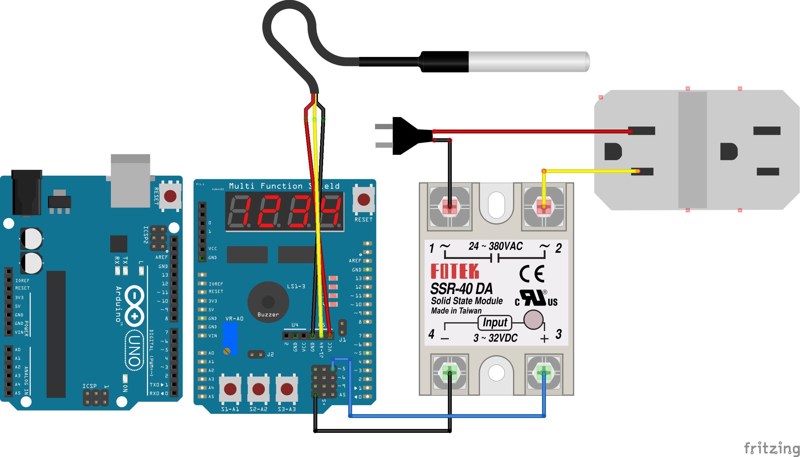

# Freezer-control

<a href="https://github.com/AlexandreMeslin/Freezer-control">Freezer Control</a> by <a href="https://github.com/AlexandreMeslin/">Alexandre Meslin</a> is marked <a href="https://creativecommons.org/publicdomain/zero/1.0/">CC0 1.0</a>

**Frameworks & Ferramentas:**

**Community Profile**

Controlador de temperatura de um freezer doméstico

- Esquemático no formato [Fritzing](Fritzing/Esquematico.fzz)
- Código fonte
- [Lista de material](Fritzing/Esquematico_bom.html)
